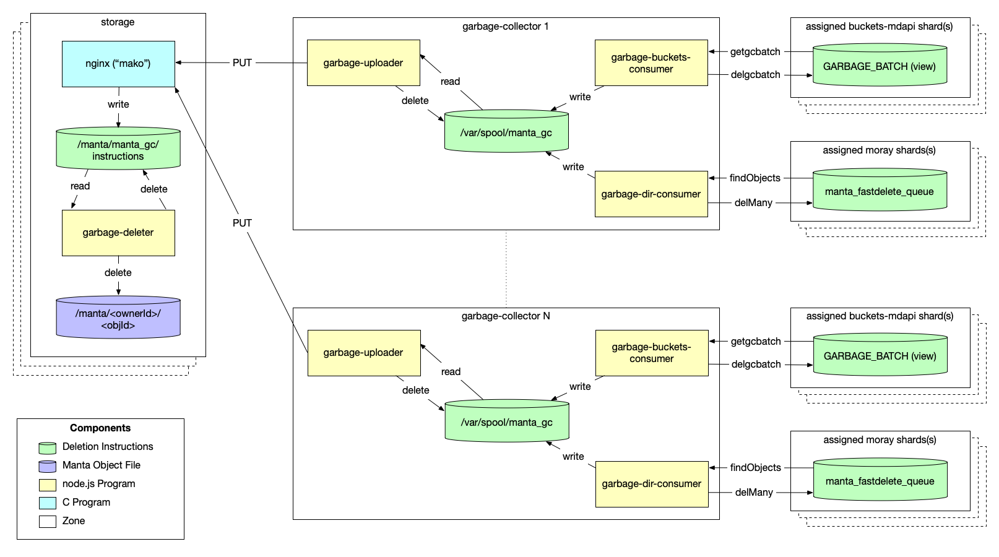

<!--
    This Source Code Form is subject to the terms of the Mozilla Public
    License, v. 2.0. If a copy of the MPL was not distributed with this
    file, You can obtain one at http://mozilla.org/MPL/2.0/.
-->

<!--
    Copyright 2020 Joyent, Inc.
-->

# Manta Garbage Collector

## Overview

This repository is part of the Joyent Manta project.  For contribution
guidelines, issues, and general documentation, visit the main
[Manta](http://github.com/joyent/manta) project page.

## Active Branches

There are currently two active branches of this repository, for the two
active major versions of Manta. See the [mantav2 overview
document](https://github.com/joyent/manta/blob/master/docs/mantav2.md) for
details on major Manta versions.

- [`master`](../../tree/master/) - For development of mantav2, the latest
  version of Manta. This is the version used by Triton.
- [`mantav1`](../../tree/mantav1/) - For development of mantav1, the long
  term support maintenance version of Manta.

# Overview

This repo contains the bulk of the code for the Manta v2 garbage collector
system. At a high-level, this system looks like:

When a Directory-style object is deleted in Manta, the "metadata" for the object is removed
(from the `manta` table) and this remove causes a record to be inserted into the
`manta_fastdelete_queue` table via a database trigger. Each of these
`manta_fastdelete_queue` records includes:

 * a creator UUID
 * an owner UUID
 * an objectId
 * a set of "sharks" (storageIds) representing `storage` servers with a copy of the object's data
 * other metadata

It's the job of the `garbage-dir-consumer` in the `garbage-collector` zone to
pull records from Moray and write them to local "instructions" files. These
instructions files are then sent to the "mako" (storage zone) that holds the
actual files for the deleted objects. The `garbage-deleter` on the storage zone
reads these instructions and does the actual deletion before deleting each
instruction file.

